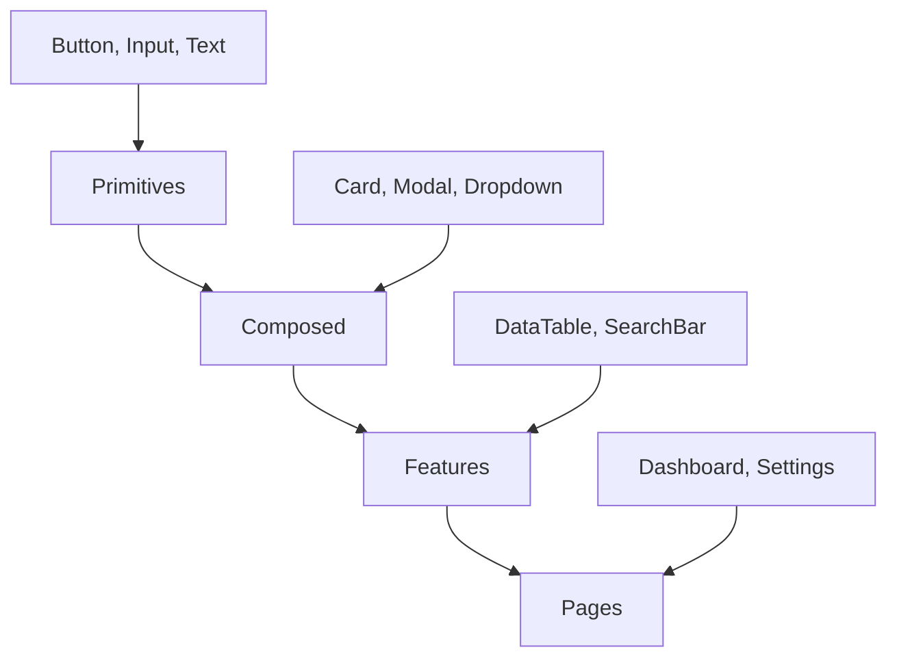

# Content Stack Design System

> A comprehensive, LLM-optimized component architecture that enforces consistency while maintaining design flexibility.

## 🎯 Overview

This design system provides a scalable approach to component-driven development with:
- **Clear dependency hierarchy**: Primitives → Composed → Features → Pages
- **Zero orphan styles**: Every component has its style companion
- **LLM-friendly patterns**: Constrained choices prevent AI hallucination
- **Utility-first flexibility**: Box primitive bridges utilities and custom CSS

## 📁 What's Included

```
design-system/
├── docs/
│   ├── COMPONENT-STYLE-CONTRACT.md    # Core rules and patterns
│   ├── COMPONENT-ARCHITECTURE.md      # Detailed architecture guide
│   ├── DESIGN-PRIMITIVES.md           # True primitive definitions
│   └── STYLE-GUIDE.md                 # CSS conventions
├── scripts/
│   ├── validate-component-styles.js   # Orphan prevention
│   ├── generate-component.js          # Component scaffolding
│   └── update-registry.js             # Registry maintenance
├── examples/
│   ├── primitive-button/              # Example primitive
│   ├── composed-card/                 # Example composed
│   └── feature-data-table/            # Example feature
└── templates/
    ├── primitive.template.tsx         # Primitive boilerplate
    ├── composed.template.tsx          # Composed boilerplate
    └── feature.template.tsx           # Feature boilerplate
```

## 🚀 Quick Start

### 1. Install Dependencies
```bash
npm install --save-dev glob
```

### 2. Run Validation
```bash
node design-system/scripts/validate-component-styles.js
```

### 3. Create New Component
```bash
node design-system/scripts/generate-component.js Button primitive
```

## 🏗️ Architecture

### Component Layers



### The Box Bridge Pattern

```typescript
// ✅ GOOD: Utilities via props, custom CSS via className
<Box 
  className="card card--glass"  // Custom styling
  padding="md"                  // Utility
  shadow="lg"                   // Utility
>
  {children}
</Box>

// ❌ BAD: Mixed utility classes
<div className="card p-md shadow-lg card--glass">
```

## 📝 Component Metadata

Every component must include comprehensive metadata:

```typescript
/**
 * @layer primitive
 * @cssFile /styles/components/button.css
 * @utilities spacing, typography
 * @variants ["primary", "secondary", "danger"]
 * @sizes ["xs", "sm", "md", "lg", "xl"]
 * @status stable
 * @since 2025-07-19
 * @a11y aria-label required for icon-only
 * @performance Debounce for heavy operations
 */
```

## 🛡️ Validation & Enforcement

### Pre-commit Hook
```json
{
  "husky": {
    "hooks": {
      "pre-commit": "npm run validate:styles"
    }
  }
}
```

### CI/CD Integration
```yaml
- name: Validate Design System
  run: |
    npm run validate:styles
    npm run validate:dependencies
```

## 🤖 LLM Integration

This system is optimized for AI-assisted development:

1. **Constrained Props**: LLMs can't invent invalid options
2. **Clear Patterns**: Consistent metadata structure
3. **Type Safety**: Props enforce valid choices
4. **Registry Lookup**: Components can query relationships

### Example LLM Prompt
```
Create a new Card component that:
- Is a composed component
- Uses Box primitive for spacing
- Has "elevated" and "flat" variants
- Includes proper metadata
```

## 📊 Component Registry

Auto-generated registry tracks all relationships:

```json
{
  "Button": {
    "layer": "primitive",
    "css": "button.css",
    "utilities": ["spacing"],
    "variants": ["primary", "secondary"],
    "usedBy": ["Card", "Modal", "Form"]
  }
}
```

## 🔧 Customization

### Adding New Utility Props to Box
```typescript
// 1. Add to BoxProps interface
interface BoxProps {
  // existing...
  textAlign?: 'left' | 'center' | 'right';
}

// 2. Map to utility class
className={clsx(
  // existing...
  textAlign && `text-${textAlign}`
)}
```

### Creating New Variants
```css
/* In component CSS file */
.card--neon {
  border: 2px solid var(--color-plasma);
  box-shadow: 0 0 20px var(--color-plasma);
}
```

## 📚 Best Practices

1. **Always use Box for utilities** - Never mix utility classes in className
2. **Document everything** - Complete metadata prevents confusion
3. **Run validation often** - Catch issues before commit
4. **Keep CSS focused** - Utilities for common, custom for unique
5. **Think in layers** - Respect the dependency hierarchy

## 🤝 Contributing

See [CONTRIBUTING.md](./CONTRIBUTING.md) for guidelines on:
- Adding new components
- Updating existing patterns
- Proposing architectural changes
- Documentation standards

## 📄 License

This design system is part of the Content Stack project and follows the same license terms.

---

Built with ❤️ for humans and AI alike.