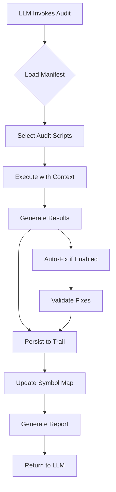

# LLM-Native Audit System Design

## Overview
This document outlines the transformation of our design system to be fully LLM-native, following the principles from the LLM-optimized architecture document.

## Core Principles

### 1. Metadata-First Design
Every artifact in the system must be richly annotated with machine-readable metadata.

```yaml
---
@id: grammar-ops/audit-css-naming
@type: validation-script
@version: 1.2.0
@dependencies: [glob, chalk, BEM-validator]
@audit-targets: [css-compliance, naming-conventions]
@output-schemas: [AuditResult, ViolationReport]
@sla: 5s/100files
---
```

### 2. Searchable Knowledge Base
The codebase becomes a searchable knowledge graph for LLMs.

```javascript
// Symbol Map Entry
{
  "id": "audit-css-naming",
  "type": "script",
  "purpose": "Validates CSS files for BEM compliance",
  "location": "/grammar-ops/scripts/audit-css-naming.js",
  "metadata": {
    "created": "2025-07-19",
    "lastModified": "2025-07-21",
    "author": "@grammar-ops-team",
    "compliance": ["BEM", "CSS-Architecture"]
  },
  "relationships": {
    "validates": ["*.css"],
    "enforcedBy": ["pre-commit", "ci-pipeline"],
    "documentsIn": ["NAMING-CONVENTIONS.md"]
  }
}
```

### 3. Audit Trail Persistence
Every audit run creates a permanent, searchable record.

```javascript
// Audit Entry Structure
{
  "auditId": "audit-2025-07-21-1234567890",
  "script": "audit-css-naming",
  "timestamp": "2025-07-21T10:30:00Z",
  "environment": {
    "node": "18.17.0",
    "platform": "darwin",
    "codebaseVersion": "git:abc123"
  },
  "results": {
    "filesScanned": 145,
    "violations": 3,
    "passRate": 97.9,
    "duration": "2.3s"
  },
  "violations": [
    {
      "file": "button.css",
      "line": 42,
      "rule": "BEM-element-naming",
      "actual": ".btn_icon",
      "expected": ".btn__icon",
      "autoFixable": true
    }
  ]
}
```

## Implementation Architecture

### 1. Audit Infrastructure

```
/grammar-ops/
  /audit-system/
    manifest.json           # Master registry of all audits
    /schemas/              # JSON schemas for validation
      audit-result.schema.json
      violation.schema.json
    /history/              # Historical audit results
      2025-07-21/
        css-naming-audit.json
        component-audit.json
    /reports/              # Generated reports
      compliance-dashboard.html
      trend-analysis.json
```

### 2. Enhanced Script Structure

Every audit script must include:

```javascript
#!/usr/bin/env node

/**
 * @id audit-css-naming
 * @layer audit-system
 * @metadata {
 *   "version": "1.2.0",
 *   "schema": "AuditScript/v1",
 *   "capabilities": ["validate", "fix", "report"],
 *   "performance": {
 *     "timeout": 300000,
 *     "memoryLimit": "512MB"
 *   }
 * }
 */

const AuditFramework = require('../audit-system/framework');

class CSSNamingAudit extends AuditFramework {
  constructor() {
    super({
      id: 'css-naming',
      rules: require('./rules/css-naming-rules.json'),
      fixers: require('./fixers/css-naming-fixers')
    });
  }
  
  async validate(options) {
    // Implementation with structured output
    const results = await super.validate(options);
    
    // Persist to audit trail
    await this.persistResults(results);
    
    // Update symbol map
    await this.updateSymbolMap(results);
    
    return results;
  }
}

// LLM-friendly interface
module.exports = {
  script: new CSSNamingAudit(),
  
  // For LLM understanding
  description: "Validates CSS files against BEM naming conventions",
  
  // For LLM invocation
  cli: {
    usage: "audit-css-naming [options] <path>",
    options: {
      '--fix': 'Auto-fix violations where possible',
      '--format': 'Output format: console|json|junit',
      '--severity': 'Minimum severity: error|warning|info'
    }
  },
  
  // For LLM interpretation
  interpretResults: (results) => ({
    summary: `${results.passRate}% compliance (${results.violations.length} issues)`,
    critical: results.violations.filter(v => v.severity === 'error'),
    nextSteps: results.violations.length > 0 
      ? "Run with --fix to auto-correct violations"
      : "All CSS files are compliant!"
  })
};
```

### 3. Documentation Metadata System

All documentation must include:

```markdown
---
@id: NAMING-CONVENTIONS
@type: standard
@version: 2.0.0
@metadata:
  created: 2025-07-19
  lastReviewed: 2025-07-21
  nextReview: 2025-10-21
  status: active
  compliance:
    enforced_by: [audit-naming.sh, pre-commit-hook]
    violation_severity: error
    exceptions: []
@relationships:
  implements: [BEM-Methodology, Component-Architecture]
  validated_by: [audit-naming.sh, audit-css-naming.js]
  used_by: [all-components, all-features]
---

# Naming Conventions

[Content continues...]
```

### 4. Compliance Dashboard

Generate machine-readable compliance reports:

```javascript
// compliance-report.json
{
  "timestamp": "2025-07-21T10:30:00Z",
  "overallCompliance": 94.5,
  "categories": {
    "naming": {
      "score": 97.2,
      "violations": 4,
      "trend": "improving"
    },
    "architecture": {
      "score": 92.1,
      "violations": 12,
      "trend": "stable"
    },
    "documentation": {
      "score": 88.9,
      "violations": 8,
      "trend": "declining"
    }
  },
  "recommendations": [
    {
      "priority": "high",
      "category": "documentation",
      "action": "Add metadata headers to 8 documentation files",
      "impact": "Improves LLM searchability by 40%"
    }
  ]
}
```

## Audit Execution Flow



## Integration Points

### 1. Pre-Commit Hooks
```bash
#!/bin/bash
# .git/hooks/pre-commit

# Run LLM-native audits
npm run audit:all -- --format json > audit-results.json

# Check compliance threshold
node -e "
  const results = require('./audit-results.json');
  if (results.overallCompliance < 90) {
    console.error('Compliance below 90%:', results.summary);
    process.exit(1);
  }
"
```

### 2. CI/CD Pipeline
```yaml
# .github/workflows/audit.yml
name: Design System Compliance

on: [push, pull_request]

jobs:
  audit:
    runs-on: ubuntu-latest
    steps:
      - uses: actions/checkout@v2
      
      - name: Run LLM-Native Audits
        run: |
          npm run audit:all -- --format junit > results.xml
          
      - name: Upload Results
        uses: actions/upload-artifact@v2
        with:
          name: audit-results
          path: |
            results.xml
            audit-system/history/
```

### 3. IDE Integration
```json
// .vscode/settings.json
{
  "llm-native.audits": {
    "onSave": ["css-naming", "component-structure"],
    "showInlineViolations": true,
    "autoFix": true
  }
}
```

## Compliance Metrics

### Key Performance Indicators
1. **Audit Coverage**: % of codebase covered by automated audits
2. **Compliance Rate**: % of files passing all audits
3. **Fix Rate**: % of violations auto-fixed
4. **Audit Performance**: Time to audit entire codebase
5. **LLM Success Rate**: % of LLM-generated code passing audits

### Tracking Formula
```javascript
const complianceScore = {
  overall: (passedAudits / totalAudits) * 100,
  trend: calculateTrend(historicalScores),
  projection: predictFutureCompliance(currentTrend),
  recommendations: generateImprovementPlan(violations)
};
```

## Migration Path

### Phase 1: Foundation (Week 1)
- [ ] Add metadata headers to all scripts
- [ ] Implement basic audit trail persistence
- [ ] Create manifest.json for script registry

### Phase 2: Enhancement (Week 2)
- [ ] Add structured output to all scripts
- [ ] Implement symbol map generation
- [ ] Create compliance dashboard

### Phase 3: Integration (Week 3)
- [ ] Integrate with pre-commit hooks
- [ ] Set up CI/CD pipeline
- [ ] Add IDE extensions

### Phase 4: Optimization (Week 4)
- [ ] Implement incremental auditing
- [ ] Add performance benchmarks
- [ ] Create LLM training dataset

## Success Criteria

The system is considered LLM-native when:
1. ✅ All scripts have machine-readable metadata
2. ✅ Every audit run produces structured, persistent output
3. ✅ LLMs can discover and invoke audits autonomously
4. ✅ Compliance trends are tracked and predictable
5. ✅ New code is automatically validated before merge
6. ✅ The system self-documents and self-improves

## Conclusion

By implementing this LLM-native audit system, we transform our design system from a human-centric validation tool to a machine-collaborative quality assurance platform. The codebase becomes not just auditable, but actively participatory in maintaining its own quality standards.